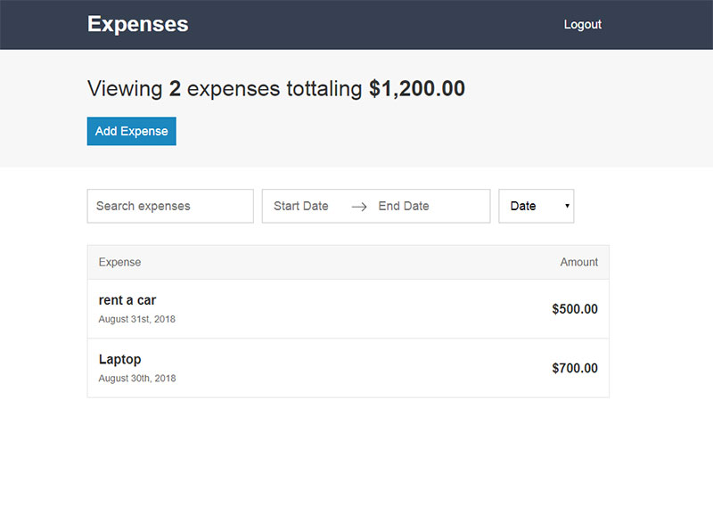
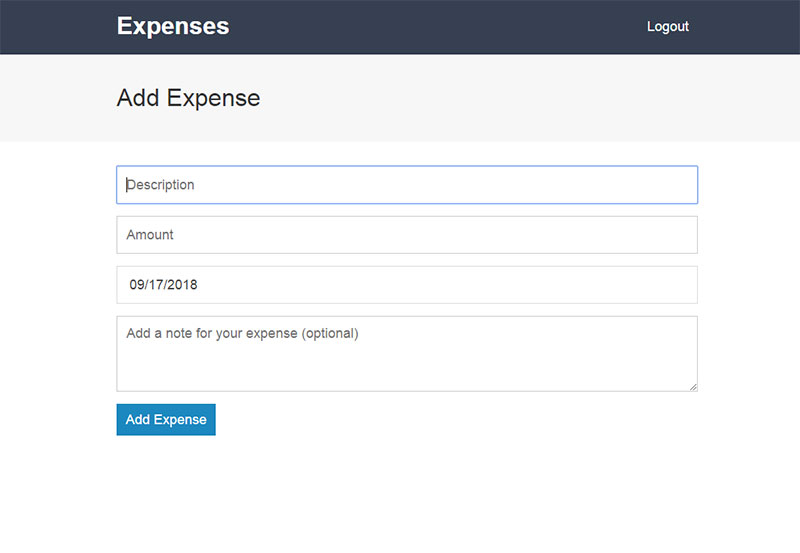

# Expenses App

Expense tracking app I built as a part of [The Complete React Web Developer Course (with Redux)](https://www.udemy.com/react-2nd-edition).

## [Live demo](https://react-expenses-project.herokuapp.com)

## Features:
- Ability to create an account using Google account
- Add new expenses
- Edit existing expenses
- Delete expenses
- Filter expenses by filter by date or name
- Sort expenses by date or amount

## Screenshots:
Dashboard Page:

Add Page:

